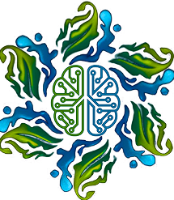

# 🌿 Eden App

Eden is a modern Flutter application designed to help users identify plants, explore botanical information, and manage their personal gardens. Built with a focus on ease of use and rich educational content, Eden leverages AI for plant identification and provides a premium UI/UX experience.

## ✨ Key Features

-   **📸 AI Plant Identification**: Instantly identify plants by scanning them with your camera or uploading photos from your gallery.
-   **📖 Detailed Plant Profiles**: Access comprehensive information about various plant species, including overview, care instructions, medical uses, and ecological impact.
-   **🏡 Digital Garden**: Save identified plants to your personal collection and track their growth.
-   **🎮 Botanical Quiz**: Test your knowledge of plants with interactive quizzes.
-   **🌍 Multi-Language Support**: Fully localized in **English**, **French**, and **Arabic** (including RTL support).
-   **🔐 Secure Authentication**: Integrated with Supabase for user accounts and data synchronization.
-   **🎨 Premium UI**: Follows a modern "Glassmorphism" aesthetic with smooth animations and dynamic layouts.

## 🛠 Tech Stack

-   **Framework**: [Flutter](https://flutter.dev/)
-   **State Management**: [Riverpod](https://riverpod.dev/) (Feature-First architecture)
-   **Backend**: [Supabase](https://supabase.com/) (Auth, Database, Storage)
-   **Deep Learning**: [TensorFlow Lite](https://www.tensorflow.org/lite) (for on-device plant identification)
-   **Navigation**: [GoRouter](https://pub.dev/packages/go_router)
-   **Local Storage**: [SharedPreferences](https://pub.dev/packages/shared_preferences)
-   **Styling**: [Google Fonts](https://pub.dev/packages/google_fonts), [Flutter SVG](https://pub.dev/packages/flutter_svg)

## 🏗 Project Architecture

The project follows a **Feature-First** structure combined with Riverpod, ensuring scalability and modularity.

```
lib/
├── core/                  # Shared functionality (providers, router, theme)
├── features/              # Modular feature folders
│   ├── auth/              # User authentication flow
│   ├── garden/            # Personal plant collection
│   ├── home/              # Main dashboard and discovery
│   ├── onboarding/        # First-time user experience
│   ├── plant_profile/     # Detailed plant species info
│   ├── quiz/              # Educational plant quiz
│   ├── scan/              # AI scanning and identification
│   └── splash/            # Application entry screen
├── main.dart              # App entry point
└── app.dart               # Root MaterialApp configuration
```

For more details, see [ARCHITECTURE.md](ARCHITECTURE.md).

## 🚀 Getting Started

### Prerequisites

-   [Flutter SDK](https://docs.flutter.dev/get-started/install) (Latest Stable)
-   [Supabase Project](https://supabase.com/) (API Key and URL)
-   Android Studio / VS Code with Flutter extensions

### Setup

1.  **Clone the repository**:
    ```bash
    git clone https://github.com/MahdiTir/eden_app.git
    cd eden_app
    ```

2.  **Environment Variables**:
    Create a `.env` file in the root directory and add your Supabase credentials:
    ```env
    SUPABASE_URL=SUPABASE_PROJECT_URL
    SUPABASE_ANON_KEY=SUPABASE_ANON_KEY
    ```

3.  **Install Dependencies**:
    ```bash
    flutter pub get
    ```

4.  **Run the App**:
    ```bash
    flutter run
    ```

## 🌐 Localization

Eden supports multiple languages. Localization files are located in `lib/l10n/`.

-   `app_en.arb` (English - Default)
-   `app_fr.arb` (French)
-   `app_ar.arb` (Arabic - RTL)

## 📷 Screenshots

| Splash Screen | Home Page | Plant Profile |
| :---: | :---: | :---: |
|  | *Coming Soon* | *Coming Soon* |

---

Developed with ❤️ by the Korax Team.
